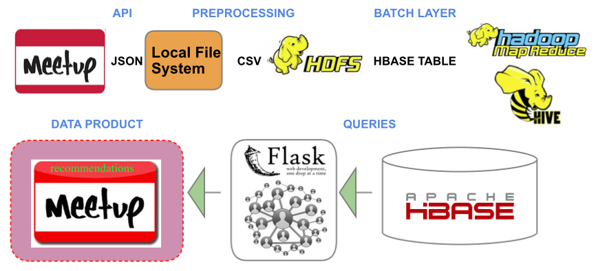

#Meetup Graph : How to foster member engagement

www.meetup.com is a great social networking portal : it enables users to meet like-minded people who have subscribed to the same groups. It is activity-centered (as opposed to relationship-centered). The idea behind my project is to augment the existing services with a social network layer : the information gathered on the website can be used to estimate the similarity between two users and ultimately provide better suggestions. More precisely, the data collected from the website will be converted into  weighted graph, representing the degree of similarity between two users. Slides available at : http://www.slideshare.net/rgn216/meetup-project1

## Data Pipeline

## Data Collection

Data is accessible through 4 channels, using meetup.com's API : groups, events, members, and RSVP. Due to the rate limit of 3 API calls/second, the data extracted was limited to San Francisco area.

## Data transformation

The JSON files are then parsed (Python script), converted into csv files and stored in HDFS (Source of Truth)

## Batch processing

The batch processing is then processed in Hive, resulting in two weighted graphs representing the degree of similarity between two users :
- number of events attended by the two users
- number of topics of interest in common

## Web UI

Ultimately, a Flask API serves the requests

## Next steps

If I had more time I would have liked to streamline the data ingestion using Kafka technology to append RSVP data in real time